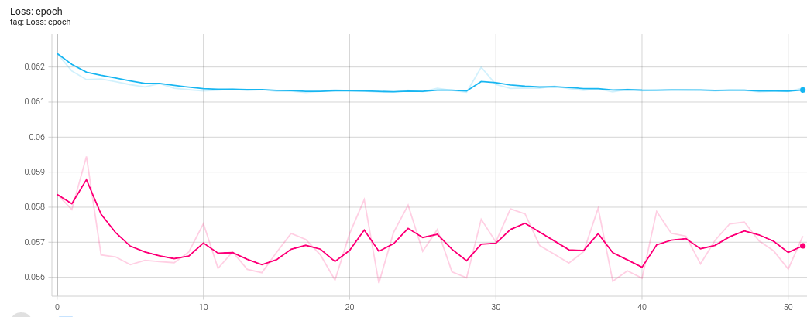
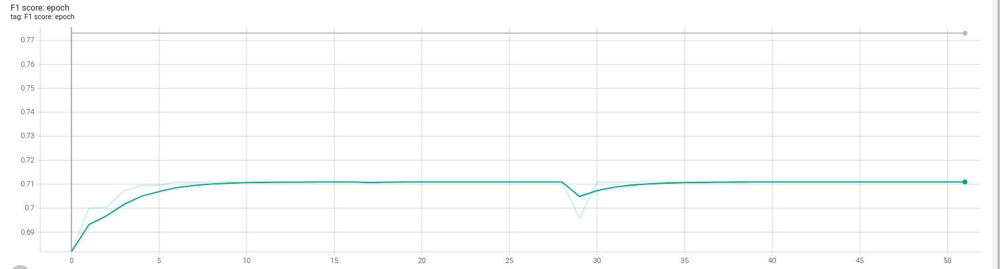

# Text Similarity
Text similarity task was implemented with using Siamese Network and Bert model on SICK dataset.

### Loss plot

 ### Evaluation plot
* After performing more than 50 epochs the F1 scores equal to 78 on train dataset and 71 on test dataset were received.
